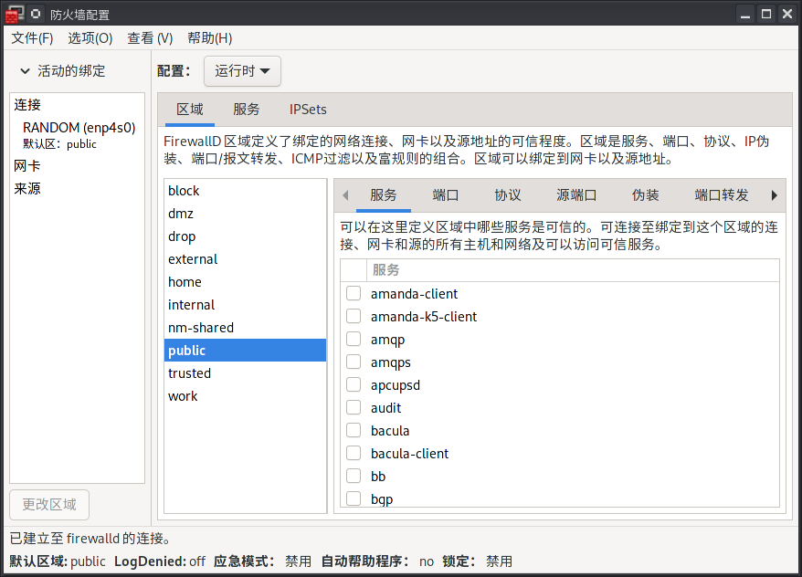

# Arch 神教

> 部分基础内容依旧在 `manjaro` 下，不做迁移。

快入 Arch 神教吧！必读 [WIKI](https://wiki.archlinux.org/)

## 配置输入法

如果有 fcitx 则先卸载：

```sh
sudo pacman -Rsc fcitx
```

接着安装 [fcitx5](https://wiki.archlinux.org/title/Fcitx5_(%E7%AE%80%E4%BD%93%E4%B8%AD%E6%96%87))：

```sh
# fcitx5-im 包组提供 fcitx5 本体、配置工具和必要的输入法模块
# 默认仅支持英文，其他语言则还需要对应的引擎 fcitx5-chinese-addons
sudo pacman -S fcitx5-im fcitx5-chinese-addons 
```

配置环境变量并重新登入：

```sh
# vim /etc/environment
GTK_IM_MODULE=fcitx
QT_IM_MODULES=wayland;fcitx
QT_IM_MODULE=fcitx
XMODIFIERS=@im=fcitx
SDL_IM_MODULE=fcitx
```

主题：

```sh
# 皮肤
sudo pacman -S fcitx5-material-color
```

输入法引擎及词库

```sh
sudo pacman -S fcitx5-rime
paru -S rime-ice-git

# 启用配置
mkdir ~/.local/share/fcitx5/rime/
cd ~/.local/share/fcitx5/rime/
vim default.custom.yaml
# patch:
#   # 仅使用「雾凇拼音」的默认配置，配置此行即可
#   __include: rime_ice_suggestion:/
#   # 以下根据自己所需自行定义，仅做参考。
#   # 针对对应处方的定制条目，请使用 <recipe>.custom.yaml 中配置，例如 rime_ice.custom.yaml
#   __patch:
#     key_binder/bindings/+:
#       # 开启逗号句号翻页
#       - { when: paging, accept: comma, send: Page_Up }
#       - { when: has_menu, accept: period, send: Page_Down }
```

**前往系统设置 > 输入与输出 > 键盘 > 虚拟键盘，选择 Fcitx 5 Wayland 启动器**

## 配置防火墙

使用 `firewall-config` 可视化配置防火墙。

```sh
sudo firewall-config
```



以放行 **`KDE Connect`** 服务为示例：

1. 配置切换到 “永久”
2. 在右下角的 “服务” 中找到 `kdeconnect`，勾选即可
3. 在左上角 “选项” 中重载防火墙

## AUR 社区仓库

使用 `paru` 替代 `yay` 对 `aur` 包进行管理。

```sh
# 安装已更新
paru -Sua

# 清理
paru --clean
```

## 在用的小工具

+ 使用 [btop](https://github.com/aristocratos/btop) 替代 top
