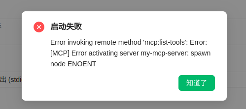

# Cherry Studio 无法执行 Node

在 Arch 下安装 Cherry Studio 后，在启动 MCP 服务器时报错如下：



这是一个典型的 `Node.js` 环境问题，排查如下：

1. 查看 Cherry Studio 包信息

   ```sh
   ❯ pacman -Qs cherry-studio
   local/cherry-studio-electron-bin 1.2.10-2
   🍒A desktop client that supports for multiple LLM providers.(Prebuilt version.Use system-wide
   electron)
   ```

2. 根据多年经验这是 `electron` 丢 `Path` 信息了
3. 找到 Cherry Studio 及 Node 位置

   ```sh
   # cherry-studio 按照规范在 /usr/share/applications/ 目录下
   which node # /home/myname/.nvm/versions/node/v22.14.0/bin/node
   ```

4. 修改 Cherry Studio 的 `.desktop` 文件

   ```sh
   # 复制到本地
   cp /usr/share/applications/cherry-studio-electron.desktop ~/.local/share/applications/
   # 修改 .desktop Exec
   vim ~/.local/share/applications/cherry-studio-electron.desktop
   # 原 `Exec=cherry-studio-electron %U`
   # 修改后 `Exec=env PATH=/home/myname/.nvm/versions/node/v22.14.0/bin:$PATH cherry-studio-electron %U`
   ```

5. 重新启动后生效
